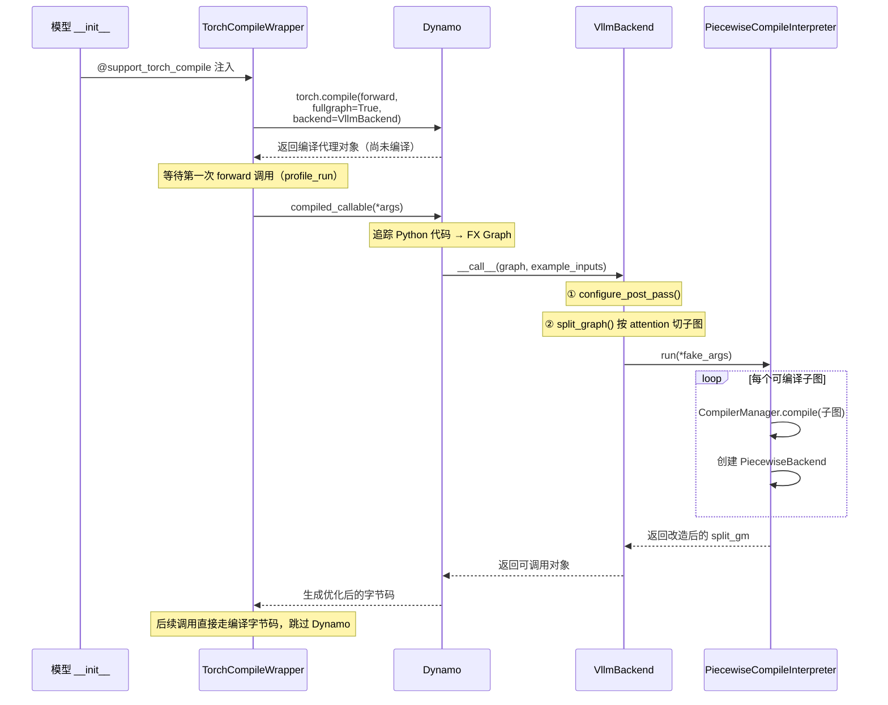

- [第一篇：有限视野下的初窥门径](/blog/graphs-in-vllm-ascend/)
- [第二篇：扩大视野，来聊聊编译](/blog/graphs-in-vllm-ascend-1/)
- [第三篇：理解全局后，再看设计方案](/blog/graphs-in-vllm-ascend-2/)
- [第四篇：进入深水区，回看那些“不得已”](/blog/graphs-in-vllm-ascend-3/)
- [第五篇：跃出水面，高维视角下的回顾](/blog/graphs-in-vllm-ascend-4/)

# 按“图”索骥：从 vLLM Ascend 的图模式聊开去

## 扩大视野，来聊聊编译

这一章我们来聊聊**编译**，在开始之前，强烈建议大家先浏览以下两篇文档，不需要逐字精读，但至少翻一遍有个印象，**如果后面有些地方看着迷糊，也可以回头来翻一翻**：

- [torch.compile](https://docs.pytorch.org/docs/stable/user_guide/torch_compiler/torch.compiler.html)：PyTorch 官方对 `torch.compile` 三层架构的介绍
- [torch.compile integration](https://docs.vllm.ai/en/latest/design/torch_compile/)：vLLM 官方的 `torch.compile` 集成设计文档

基础的概念我们不会在这篇文章中深究，那样事情就会变得无聊冗长了，而且实属重复造轮子。

### 都叫“图”，有啥不同？

有个问题我一直想找机会说清楚：`torch.compile` 和 CUDA Graph 都跟“图”沾边，但它们**完全不是一回事**。很多人来问问题的时候，问题里问的是“ACL Graph 如何如何”，但实际上问题属于编译的范畴（比如启动时出现 Dynamo 的报错），这一点大家一定要搞清楚。

**`torch.compile` 是编译期的优化。** 它做的事情是：把你写的 Python 代码追踪（trace）成一张计算图（FX Graph），然后在这张图上做各种变换：算子融合、内存优化、最后直接生成更贴近硬件的 kernel 代码（比如 GPU 上的 Triton kernel）。即使不配合 CUDA Graph，仅仅以普通的 eager 路径去执行这些编译后的子图，性能也可能比原始 eager 执行更好。但当它和 CUDA Graph 叠加时，重点就不再是 CPU 侧的 launch 开销，而是 fusion、codegen 以及调度优化带来的收益。

**CUDA Graph 是运行期的优化。** 它做的事情是：在第一次运行时，把 GPU 上所有的 kernel 启动序列“捕获”下来，之后每次推理直接“回放”这段录像，省掉了 CPU 侧反复下发 kernel 的开销。它不关心你的代码写得好不好、有没有优化过，它只管“一次性下发”。

因为它们解决的是不同层面的问题，所以两者可以结合起来使用：`torch.compile` 让你的计算本身跑得更快（更少的 kernel、更少的中间张量，不同资源利用效率更高），CUDA Graph 让计算的**启动开销**趋近于零。打个比方：`torch.compile` 是把统筹规划，把原先的十道菜，合成五道菜，营养不变，CUDA Graph 则是把炒菜的动作从“备菜 - 做菜”变成“流水线自动做菜”。两者叠加，才有了我们现在看到的图模式性能。

**编译的核心收益，是 fusion pass，算子融合。**

什么意思呢？假设模型中有一段逻辑是 `RMSNorm → Quantize → ...`，在 eager 模式下，每个操作都是一个独立的 kernel launch：先启动 RMSNorm 的 kernel，等它算完，把结果写回显存，再启动 Quantize 的 kernel，再从显存读取。看，多么麻烦！

而 fusion pass 做的事情，就是**在 FX 图上做模式匹配**：发现“诶，这两个操作可以合并成一个”，然后直接替换成一个融合后的算子。一次 launch，一次读写，干完两件事。**当然前提是你得有这么些个对应的融合算子。**

在 GPU 上，vLLM 的 `PostGradPassManager` 注册了 8 个以上的 fusion pass，覆盖了 AllReduce + RMSNorm 融合、RMSNorm + Quantize 融合、RoPE + KV Cache 融合等常见模式。这些 pass 是在 Inductor 内部通过 `post_grad_custom_post_pass` 钩子执行的，也就是说，Inductor 在把 FX 图转成 Triton kernel（lowering）之前，会先跑一遍这些 vLLM 自定义的融合规则。除此之外，Inductor 自身还有 codegen 层面的优化：它会自动生成针对具体 shape 的 Triton kernel，支持 auto-tuning 来选择最优的 kernel 参数等等。这些都是 eager 模式下享受不到的。

### 那它有啥用？

`torch.compile` 在 vLLM 中除了编译优化，还做了什么？诶，很多人可能知道 `PIECEWISE` 这种图模式，具体这模式是啥我们后面再讲。顾名思义，`PIECEWISE` 它得把图处理成一个个“PIECE”啊，那“切图”这部分工作就是在编译这阶段完成的：将 attention 部分的代码，统一注册成一个自定义算子，把模型按这些自定义算子切成若干子图，好让 CUDA Graph 分段捕获。如果没有编译，将各种模型结构处理成统一的中间表示，那么这个切分逻辑的维护成本，可能就会相当之高了。

**当我们说“编译”的时候，切图只是其中一个环节，fusion pass 加上 Inductor 优化才是性能收益的大头。** 理解了这一点，也就不难理解为什么后面我们要花笔墨讲 Ascend 在没有 Inductor 的情况下是怎么做的了。

### 简单看下 vLLM 的编译链路

有了以上的认知，我们来快速过一遍 vLLM 中 `torch.compile` 的工作流程。



一切从 `@support_torch_compile` 装饰器开始。这个装饰器并不会直接编译任何东西：在模型的 `__init__` 阶段调用 `torch.compile(self.forward, fullgraph=True, backend=VllmBackend)`，拿到一个编译代理对象。但真正的编译要等到模型第一次 `forward` 调用时才会触发，这就是惰性编译（Lazy Compilation）。

当第一次 `forward` 被调用，也就是 `profile_run` 的时候，Dynamo 开始追踪 Python 代码，生成一张完整的 FX Graph，然后把它交给 `VllmBackend`。`VllmBackend` 拿到图之后做了三件关键的事：

1. **`configure_post_pass()`**：把前面说的那些 fusion pass 注册到 Inductor 的配置里，等后续编译子图时让 Inductor 去调用。
2. **`split_graph()`**：按 attention 算子把整张大图切成若干子图。为什么要在 attention 处切？因为 attention 的逻辑比较复杂且多变（不同的 backend、不同的 shape 策略），有时候不兼容 CUDA Graph，所以 vLLM 选择让 attention 跑 eager，其余部分才走图模式。
3. **`PiecewiseCompileInterpreter`**：遍历切好的子图，为每个子图创建一个 `PiecewiseBackend` 实例。这个实例负责在运行时根据实际的 token 数量（runtime shape），分发到对应的编译版本去执行。

至此，编译阶段完成。后续的每一次 `forward` 调用，都会跳过 Dynamo 的 guard 检查，直接走已编译好的路径。

### vLLM Ascend：没有 Inductor 怎么办

到这里，大家可能已经发现了一个问题：上面整条链路里，Inductor 扮演着核心角色，fusion pass 要靠它的钩子来跑，codegen 要靠它来做，auto-tuning 也是它的活儿。**那如果没有 Inductor 呢？**

这正是 vLLM Ascend 面对的现实。昇腾硬件上没有成熟的 Triton 作为 Inductor 后端（这一点我们在第一章的“编译后端的支持完善程度”中提过），这意味着 Inductor 的整条路走不通。但 fusion pass 带来的性能收益我们又不想放弃，那咋整呢？

答案是：**绕过 Inductor，但保留 fusion pass 的能力。**

当 `PiecewiseCompileInterpreter` 遍历到某个子图需要编译时，调用链走到的不再是 Inductor，而是 `AscendCompiler.compile()`。这个方法内部调用了 `fusion_pass_compile()`，其中的核心是一个叫 `compile_inner` 的闭包：

```python
def compile_inner(graph, example_inputs):
    current_pass_manager = compiler_config[COMPILATION_PASS_KEY]
    graph = current_pass_manager(graph)  # 跑 Ascend 的 fusion pass
    return graph  # 直接返回修改后的 GraphModule
```

这个 `compile_inner` 被当作 `fw_compiler`（前向编译器）传给了 `aot_autograd`。AOT Autograd 完成 functionalization 之后，回调 `compile_inner`，在这里面跑 `GraphFusionPassManager` 的所有 pass，然后直接把修改后的 FX GraphModule 返回。

**没有 Triton codegen，没有 `.so` 生成，没有 auto-tuning**，取而代之的是：fusion pass 把多个小算子替换成 Ascend 的融合自定义算子（通过 `torch_npu` dispatch 到 CANN 的优化 kernel），然后以 eager 模式执行这张优化过的图。

`GraphFusionPassManager` 当前注册了一些 Ascend 专属的 fusion pass，每个 pass 都使用 PyTorch 的 `PatternMatcherPass` 在 FX 图上做子图模式匹配和替换，这与 GPU 侧的 fusion pass 在技术手段上是完全一致的，区别只在于匹配的模式和替换的目标算子不同。

### 第三条路：npugraph_ex

上面说的 `fusion_pass_compile` 是之前的“权宜之计”。现在我们有了 `npugraph_ex`，这是基于 torchair（昇腾的 PyTorch 图编译器）的第三条编译路径。从 v0.15.0rc1（2026-02-12）起默认开启，但仅在 `FULL_DECODE_ONLY / FULL` 模式下生效，而在 `PIECEWISE` 模式下 platform.py 会强制关闭它，回退到 `fusion_pass_compile`。

npugraph_ex 基于昇腾的 [torchair](https://gitcode.com/Ascend/torchair) 图编译器。虽然同样经过 AOT Autograd 的 functionalization，但之后由 torchair 接管 FX 图的优化和编译：

那 fusion pass 怎么办？难道要维护两套吗？这里有一个巧妙的设计：vLLM Ascend 的每个 fusion pass 在注册时，**同时注册到两个引擎：** 既注册到 inductor 的 `PatternMatcherPass`（给 `fusion_pass_compile` 用），也通过 `torchair.register_replacement` 注册到 torchair（给 npugraph_ex 用）。同一套 pass 定义，两条执行通道，走哪条路都能生效。

此外，torchair 自身还额外带来了一些 `fusion_pass_compile` 没有的优化：逆转 AOT 的 functionalization（恢复 in-place 操作以减少内存搬移），以及[几个内置的算子融合规则](https://www.hiascend.com/document/detail/zh/Pytorch/730/modthirdparty/torchairuseguide/torchair_00017.html)。

下面这张图展示了完整的三条编译链路。共用部分从 Dynamo 一直延伸到 `CompilerManager.compile()`，在此之后 GPU 和 Ascend 分道扬镳；而 Ascend 内部又根据图模式进一步分岔：

```mermaid
flowchart LR
    A["<b>Dynamo</b><br/>追踪 forward<br/>→ FX Graph"] --> B["<b>VllmBackend</b><br/>configure_post_pass()"] --> C["<b>split_graph</b><br/>按 attention 切子图"] --> D["<b>PiecewiseCompile<br/>Interpreter</b><br/>遍历子图"] --> F{{"<b>CompilerManager<br/>.compile()</b><br/>分岔点 ①"}}

    F -->|"GPU · InductorAdaptor"| H1["<b>AOT Autograd</b><br/>functionalization"]
    F -->|"Ascend · AscendCompiler"| G{{"<b>enable_npugraph_ex?</b><br/>分岔点 ②"}}

    G -->|"False（PIECEWISE）"| H2["<b>AOT Autograd</b><br/>functionalization"]
    G -->|"True（FULL）"| H3["<b>AOT Autograd</b><br/>functionalization"]

    H1 --> I1["Inductor 调钩子<br/><b>PostGradPassManager</b><br/>8+ fusion pass"]
    H2 --> I2["compile_inner 回调<br/><b>GraphFusionPassManager</b><br/>Ascend fusion pass"]
    H3 --> I3["torchair 内部<br/><b>FX 优化 + fusion pass</b><br/>+ in-place 恢复"]

    I1 --> J1["Inductor <b>lowering</b><br/>→ Triton codegen"]
    I2 --> J2["<b>直接返回</b><br/>eager GraphModule"]
    I3 --> J3["编译为<br/><b>ACL Graph</b> 可执行形式"]

    J1 --> L["<b>CUDAGraph / ACLGraph</b><br/>Wrapper 包裹"]
    J2 --> L
    J3 --> L

    style F fill:#fff9c4,stroke:#f57f17,stroke-width:2px,color:#000
    style G fill:#fff9c4,stroke:#f57f17,stroke-width:2px,color:#000
    style I1 fill:#fff3e0,stroke:#e65100,color:#000
    style J1 fill:#fff3e0,stroke:#e65100,color:#000
    style I2 fill:#e3f2fd,stroke:#1565c0,color:#000
    style J2 fill:#e3f2fd,stroke:#1565c0,color:#000
    style I3 fill:#e8f5e9,stroke:#2e7d32,color:#000
    style J3 fill:#e8f5e9,stroke:#2e7d32,color:#000
```



### 方案路线沿革

说到这里容我忆苦思甜一下，上面这张三条路并行的图看着挺整齐，但 Ascend 的编译方案并非一步到位，而是经历了四代演进：

1. **手动改写模型脚本**：最早期的做法。每个模型里该融合的算子，都要手动改写并覆盖 vLLM 的模型定义。每出一个新模型就要改一次，没改过的模型享受不到任何优化，适配成本极高。
2. **`GraphRewriter` 方案**：引入了 PyTorch 的 `GraphRewriter` 组件，算是有了统一的改图接口，但仍然不够灵活。
3. **`AscendCompiler` + `fusion_pass_compile`**：也就是上文介绍的蓝色路径。通过平台钩子接入 vLLM 的编译框架，用 `PatternMatcherPass` 做自动化的子图匹配和替换，终于摆脱了逐模型手改的困境。
4. **npugraph_ex**：也就是绿色路径。由 torchair 接管编译，自带额外优化，目前是 FULL 模式下的默认方案。

从“每个模型手动改”到“框架自动做”，用了不少时间，**把优化逻辑从模型代码中彻底剥离，下沉到编译层去自动完成。** 不过注意，现在依然是没有 codegen 能力的。

但是下一步呢？我们什么时候能用上和 CUDA 一样原生的 Inductor 能力呢？还是说会有其他的路线？这些问题暂时还不明朗。
