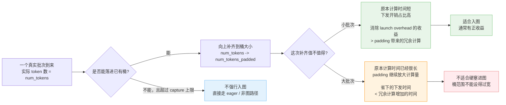

- [第一篇：有限视野下的初窥门径](/blog/graphs-in-vllm-ascend/)
- [第二篇：扩大视野，来聊聊编译](/blog/graphs-in-vllm-ascend-1/)
- [第三篇：理解全局后，再看设计方案](/blog/graphs-in-vllm-ascend-2/)
- [第四篇：进入深水区，回看那些“不得已”](/blog/graphs-in-vllm-ascend-3/)
- [第五篇：跃出水面，高维视角下的回顾](/blog/graphs-in-vllm-ascend-4/)

# 按“图”索骥：从 vLLM Ascend 的图模式聊开去

## 理解全局后，再看设计方案

编译的话题告一段落，图模式的两大板块儿我们就算是都讲过一点儿了，那这一章我们重新回到设计方案上来，顺带讲一些其他的基础概念。

### 动态性与静态图

还记得我们之前说 FIA 的校验反复造成困扰吗？它的 Host 参数又是怎么在图模式里刷新的？这一章。但在那之前，先聊一个看似简单、却牵扯出连锁反应的基础问题：**动态性与静态图的矛盾** 。

#### 图模式的约束

PyTorch 官方文档中有一段非常精炼的 [Constraints](https://docs.pytorch.org/docs/main/notes/cuda.html#constraints) 说明，**强烈建议快速过一遍**。其中最基本的：

- **Dynamic shapes are prohibited.** 图假设捕获序列中的每个张量，在每次重放时具有相同的大小和布局。
- **Every replay reads from and writes to the same (virtual) memory addresses.** 重放时不会重新分配内存，直接使用捕获时的地址。
- **Ops that synchronize the CPU with the GPU are prohibited.** 比如 `.item()` 这类操作，在图内是不允许的。

也就是说 **图内的一切都是“定死”的：形状、地址、执行路径。**

#### 形状上的动态转静态

那问题来了：推理服务中每个批次的请求数量是变化的，`num_tokens` 不可能每次都一样，这就是 **张量形状的动态性** 。怎么办？

答案是**分桶（Bucketing）**：提前选好一组固定的桶大小，针对每个桶大小各捕获一张图。然后运行时把实际的 `num_tokens` 向上取整到最近的桶大小，多出来的部分用 padding 填充。

vLLM 中默认的桶列表长这样：

```
[1, 2, 4, 8, 16, 24, ..., 248, 256, 272, 288, ..., max]
```

小批次间隔密（步长 8），大批次间隔稀（步长 16），`max` 默认是 `min(max_num_seqs * decode_query_len * 2, 512)`。`CudagraphDispatcher` 在初始化时会用这组数字构建一张 O(1) 的查找表。给定任意 `num_tokens`，直接查表就能得到它该用哪个桶，一次数组访问搞定，不需要二分查找。

> NPU 上有一些细微差异：默认的 `max` 更保守（去掉 `*2`，这个是受 MC2 通信算子的影响，哎，又是一个特殊问题），SP 模式下还会过滤掉不能被 `tp_size` 整除的桶。但整体策略完全一致。

##### 当填充遇上 FIA

好，终于到了复盘环节，先回忆一下校验：

> `actualSequenceLengthQ[-1] == queryT.shape[0]`

**问题的本质**：图模式将 `hidden_states` 的第 0 维填充到了桶大小（一个固定值），但 FIA 要求 `actual_seq_lengths_q` 的最后一个元素也等于这个固定值。而 `actual_seq_lengths_q` 是根据实际请求数量构建的，**两者天然对不上。**

在上游 vLLM 中，GPU 的 Attention 算子没有这个校验，所以填充就是填充，不需要额外操心。但在 vLLM Ascend 中，**每一个涉及“改变 token 数量”的特性，都会独立地触发这个问题，叠加起来，更是恐怖：**

1. **基础图模式**：桶填充导致 `shape[0]` 膨胀 → 引入了修复方法，在 `query_start_loc` 末尾插入虚假请求，让最后一个元素等于填充后的 `num_tokens`。这个函数目前在 v1、v2、310P 三套 Model Runner 中各有一份独立拷贝。

2. **SP（序列并行）**：SP 也会把 `num_tokens` 向上对齐到 `tp_size` 的倍数。所以即时不开启图模式，也需要为这个校验而修复。

3. **DP（数据并行）**：`dp_size > 1` 时，所有 rank 的 `num_tokens` 会通过 all-reduce 统一到最大值。本 rank 可能只有 5 个 token，但全组最大是 8，那你的 `num_tokens_padded` 就变成了 8，又多了一层填充需要善后。

4. **MTP / Eagle**：首先，推测解码的首轮和后续轮次，批次大小是不一样的，这就已经有问题了，更添乱的是，vLLM V1 中的推测解码，被设计为不支持 `FULL` 模式，所以会对相关属性做“去填充”的操作。所以这一部分的代码目前看来是到处漏风，只能祈祷原生支持 `FULL` 模式的 V2 能够拯救未来的代码仓了。

6. **CP（上下文并行）**：每个 rank 分到的 token 数与填充后总量不一致，需要额外补零；MLA+CP 甚至直接用一个 `arange` 替换掉了原始的 `actual_seq_lengths_q`。

**多个场景，同一个坑。** 这就是“组合爆炸”，也就是之前说的“造成了很多次严重的问题”：每个独立的特性都会改变 token 的数量或分布，而 FIA 的这个校验在上游 vLLM 中不存在，不会有上游开发者帮你预想到这个约束。每次引入新的并行策略或投机解码方案，都要有人 **“重新发现”** 这个问题，然后在各自的代码路径中修一个 patch。

#### Host 侧数据的动态更新

除去形状动态性，另一个动态性：**FIA 要求 `actual_seq_lengths` 以 Python list 形式传入**，而图重放时只会重复捕获时冻结的旧值。

还记得我们在第一章怎么说的吗？

> 对于图内的算子来说，它们没有办法获取到最新的 `actual_seq_lengths` 信息。那么最后模型输出出来的结果自然就会是重复的文本，因为图中只有捕获时的“过时信息”。

解法分两步：

**捕获时“预埋”**：图捕获阶段，每层 Attention 中的 FIA 调用被包裹在 `graph_task_group_begin/end` 之间。这对 API 会告诉 CANN：“我们后面会重新下发这一部分”，并返回一个 handle。同时，在 FIA 前面还会植入一个 `ExternalEvent.wait` 来等待更新操作执行完毕，图重放到这里会暂停，等信号才继续。

**重放时“更新”**：每次 replay 之后，在一条专用的 `update_stream` 上，通过 `graph_task_update_begin/end` 打开保存的 handle，传入当前批次真实值，重新下发并做 tiling，然后 `event.record` 发出信号。主流上的 FIA 收到信号，带着新参数继续执行。

**`ExternalEvent` 是整套机制的时序保证**：不管两条流的执行速度差多少，FIA 一定是拿到了当前批次的参数之后才会执行。这个设计在主流 CUDA Graph 生态中找不到对应物，它完全是为了适配 FIA 的 Host 参数特性而生的。

### FULL? PIECEWISE? FULL_AND_PIECEWISE?

这一章我们来细致讲讲不同的图模式，同时也解释前文中讲到的“资源限制问题”。

#### vLLM 图模式沿革

首先，vLLM 的图模式演进其实挺有意思的，我们可以简单快速看下，了解下背景。

##### 第一阶段：Piecewise 的探索与成熟（2024 年下半年）

最开始，vLLM 在 V1 里引入了 piecewise CUDA graphs（[PR #10058](https://github.com/vllm-project/vllm/pull/10058)）。这个想法挺自然的：把模型按 attention 切成若干子图，attention 部分跑 eager，其余部分走图模式，这样既能减少 kernel launch overhead，又能避免 attention 那些复杂多变的逻辑给图模式带来麻烦。

之后就是一些收尾工作了：统一 padding 逻辑（[PR #10996](https://github.com/vllm-project/vllm/pull/10996)）、把 compile sizes 和 cudagraph sizes 解耦（[PR #12243](https://github.com/vllm-project/vllm/pull/12243)）。这些改动为后续 full graph 的引入打下了基础。

##### 第二阶段：Full Graph 的引入与架构重构（2025 年）

到了 2025 年，出于对性能的考虑，vLLM 开始尝试捕获整个模型前向传播的单一 CUDA graph，把 attention 也包进去。第一次尝试（[PR #16072](https://github.com/vllm-project/vllm/pull/16072)）非常简陋，几乎没有独立的设计，只是将 `vllm.unified_attention` 与 `vllm.unified_attention_with_output` 从 `splitting_ops` 中移除了而已，且只支持 FA3。整体和当时的分段图设计耦合得非常紧密。

真正的大重构是 [PR #20059](https://github.com/vllm-project/vllm/pull/20059)。这次重构把 cudagraph 从 compilation 中解耦出来，引入了 `CUDAGraphMode` 枚举（`NONE` / `PIECEWISE` / `FULL` / `FULL_DECODE_ONLY` / `FULL_AND_PIECEWISE`），还有 `CUDAGraphWrapper` 和 `CUDAGraphDispatcher`。这也就是现在仓库中的设计，利用 `CUDAGraphWrapper` 将分段图和整图统一了起来，也算是有了正式的方案。

重构之后就是一些完善工作了：把 graph mode 能力判断抽象到 platform interface（[PR #25161](https://github.com/vllm-project/vllm/pull/25161)），默认模式从 PIECEWISE 切到 FULL_AND_PIECEWISE（[PR #25444](https://github.com/vllm-project/vllm/pull/25444)），对 encoder-decoder、DCP 这些特殊场景做特例处理。这些改动让图模式从一个实验性特性，变成了一个相对成熟、有清晰默认策略的产品功能。

##### 后续的变化：V2 Model Runner 的图模式

V2 的设计还不稳定，我们不过多描述。

V2 再次调整了整图的设计：引入了单独的代码路径（[PR #32771](https://github.com/vllm-project/vllm/pull/32771)）。可能也更模块化了，不再是统一的包装器，而是有通用的 `CudaGraphManager`、主模型的 `ModelCudaGraphManager`、和 Eagle 的 `EagleCudaGraphManager`。

V2 引入独立管理，似乎是把 full graph 和 piecewise graph 又独立开来了。这套设计其实和早期的 simple cuda graph [PR #20328](https://github.com/vllm-project/vllm/pull/20328) 有点像，同时也更贴近 SGLang 的设计。

#### 不同模式的区别和比较

到这里，几种图模式的名字差不多都露过脸了，但如果只记名字，其实很容易越看越糊涂。**这些模式并不是在给用户制造选择困难，而是在回答两个简单问题：attention 这块到底要不要进图？prefill 和 decode 又要不要用同一种策略？**

哦注意，我们这儿说的“attention”和“forward”，它的范围，统一指的是 `unified_attn_with_output` 这个自定义算子里的代码，不只是单纯的 attention 计算，**像 KV Cache 和 RoPE 相关的操作也在里面**。

先说最基础的两个模式。

- **`PIECEWISE`**：把整个 forward 按 attention 切成若干子图（切图的方式我们已经在前文讲过了），attention 自己跑 eager，其余部分走图。它的动机非常朴素：一般来说，attention 往往是最麻烦的一段，backend 差异多，shape 变化也多，先把它留在图外，换来的是更高的兼容性。代价也很直接：没有把 attention 这块 launch overhead 给解决掉，所以性能在某些场景不如整图高。
- **`FULL`**：整个 forward 就是一张图，attention 也在里面。这个方案最“理想主义”，因为它把图模式的收益吃得最完整：路径统一，launch 开销最低，运行时调度也最干净。但也正因为它什么都想包进去，所以对 attention backend、模型路径、shape 管理的要求最苛刻，一旦某个环节不满足条件，就只能降级。

然后是 `FULL_DECODE_ONLY`：这个模式加了一点策略：只在纯 decode 阶段走整图，prefill 批次或者混合批次退回 eager。为什么要这么干？因为 decode 的 batch 更规整，尤其是普通单 token decode，最适合捕获并重放整图；而 prefill 往往 `query_len` 更长，shape 更活跃，图模式的成本大，收益还没那么稳定，那不就算咯？所以这模式的思路就是：**只在成本低，收益高的纯解码批次才应用图模式。**

接下来就是 vLLM V1 现在的默认模式：**`FULL_AND_PIECEWISE`**。它本质上是一个混合策略：**decode 走 `FULL`，prefill 走 `PIECEWISE`。** 这其实也点出了 prefill 和 decode 的根本差异：decode 更“规整”，适合整图；prefill 更“活”，适合保守一些，给 attention 留出 eager 的退路。站在工程实现的角度看，这个默认值是比较合理，能吃到 decode 侧最主要的图模式收益，又不想把 prefill 那一堆复杂情况全都硬塞进一张大图里，所以通常是性能与兼容性的折中最优解。如果我没记错的话，SGLang 的策略也是如此。

最后，**图模式能不能用、最终会落到哪种模式，很多时候不是用户“想选什么”就能选什么，而是由兼容性检查决定的。** 最常见的约束有这么几类：

1. **Attention backend 的能力边界。** 有些 backend 只能支持 decode 侧的整图，有些连 uniform batch 都不接受，更别说 full graph 了。此时你即便手工指定 `FULL`，运行时也可能被自动降级到 `FULL_AND_PIECEWISE`、`FULL_DECODE_ONLY`，甚至 `PIECEWISE`。
2. **模型结构本身的限制。** 并不是所有模型路径都适合整图，例如 encoder-decoder、pooling 一类特殊结构，在上游 vLLM 中本来就有单独的兼容性处理。
3. **运行时 shape 的动态性。** 图模式终究还是静态图，即使是 `FULL_AND_PIECEWISE`，如果批次过大，超出了最大桶，那一样会回退 eager 模式。

另外，如果你想考虑捕获开销，那你可能也需要考虑手动设置一下模式和桶，否则服务启动时间和内存占用大小也会是一个麻烦，比如这里提到的[设备内存问题](https://docs.vllm.ai/en/latest/configuration/conserving_memory/#reduce-cuda-graphs)。

所以从使用层面看，一般来说 **优先相信默认值。** 如果能正常用 `FULL_AND_PIECEWISE`，说明 attention backend 和模型路径都还算“配合”。如果有问题，再去看是退到 `FULL_DECODE_ONLY` 还是 `PIECEWISE`，背后对应的往往是某些兼容性问题。

换句话说，vLLM 针对 **“性能”和“易用”做了取舍**，这些模式就是照顾各个不同的场景。理解了这一点，我们再来看看 vLLM Ascend 中还有哪些问题。

#### Ascend 上流资源的规格限制

无独有偶，GPU 上有这么些取舍，那 NPU 上也有自己的问题要考虑。这也正是我们在第一章埋下的伏笔，前面提过，ACL Graph 的捕获会受流资源上限约束，而这件事一旦叠到 `PIECEWISE` 模式（包括 `FULL_AND_PIECEWISE` 模式）上，问题就来了。

当然我们现在已经实现了显式保护逻辑：`vllm_ascend/utils.py` 里的 `update_aclgraph_sizes()` 会在 `PIECEWISE` 模式下自动改写 `cudagraph_capture_sizes`。它开头就把约束写得很直白：**当前 ACL Graph 最多按 1800 张图来估算**，原因是底层流总数按 2048 计算，并额外预留了 248 条作为 buffer（因为无法感知其它组件申请了多少流，所以只能拍脑袋硬编码一个数）。

那为什么这个问题在 `PIECEWISE` 下特别容易爆出来？因为 `PIECEWISE` 不是“每个桶对应一张图”，而是“**每个桶对应很多张子图**”：每一个被切分的子图，都需要单独捕获为一个 graph 对象。

$$
\text{图资源消耗} \approx \text{桶数} \times (\text{num\_hidden\_layers} + 1) \times \text{并行/通信乘数}
$$

其中 `num_hidden_layers + 1` 是因为一次前向，里面有 `num_hidden_layers` 次 attention，那么切 `n` 刀，图自然会变成 `n + 1` 份儿；如果还带推测解码里的草稿模型，那还得把草稿模型的层数也加进去。到了这里，前面那个“几千条流也能用完？”的问题就有答案了：**单看一个桶也许不夸张，但一旦桶数、层数、通信域数同时上来，消耗会很快失控。**

为什么需要考虑通信呢？因为在图中，不是计算人物会消耗流资源，通信同时也会消耗流资源，而且不同的通信域，无法共用同一条流。也就是说，**为了支持这一组 batch size，你得考虑总共须得捕获多少图，每张图里占掉多少流。**

这也解释了为什么 `FULL` 在这里看起来“没那么容易出事”，**因为它不会被切成那么多张子图**。注意，我这里说的是**就这段代码体现出来的流预算问题而言**。在 `platform.py` 里，只有 `PIECEWISE` 分支会调用 `update_aclgraph_sizes()`；`FULL / FULL_DECODE_ONLY` 分支并没有接入这套按层数和通信域估算图资源的自动裁剪逻辑。

所以，`FULL` 在 Ascend 上多了一个额外的“资源消耗少”的优势，再加上它“性能好”，所以在这个平台上默认是推荐启用 `FULL / FULL_DECODE_ONLY` 的。

回到 `update_aclgraph_sizes()`，其约束方式也很朴素，不是去重新设计桶，而是**直接裁桶**。如果它算出来当前硬件最多只能承受 `N` 个 capture sizes，而用户或默认配置给了更多，它就会从原始 `cudagraph_capture_sizes` 里做一次**等间隔抽样**，同时强制保留首尾两个桶。说白了就是：**既然一口气把所有桶都抓下来会把流打满，那就优先保住最小和最大的边界，再在中间挑一些有代表性的桶留下。** 这并非最优选择，不过当前也没有什么好的办法。

那大家就想问，那 GPU 那边的行为是什么呢？难道它捕获图不需要消耗流资源？它的流资源没有上限吗？为什么 NPU 不能和 GPU 的行为统一？这些问题，就涉及到下层组件的设计了，在这里我暂时收笔，不纳入本次讨论中。

### 有关性能与应用总结

前面其实已经把图模式的两类收益拆开讲过了：**运行期**靠 replay 减少 launch overhead，**编译期**则靠 fusion pass 和编译后端减少 kernel 数量、内存搬移与中间开销。这里就不再重复解释原理了，只讨论一个更直接的问题：**这些收益在不同模式里，究竟能兑现到什么程度？**

前文没提到的一点，是编译的问题。按照 vLLM 一开始的设计，其实那些被包装进自定义算子的部分，比如 attention 的 `unified_attn_with_output`，或者 MoE 的 `moe_forward`，**这一部分是没法做任何替换或者融合工作的**。这下糟了，那咋办呢？后来在这个 [RFC #23261](https://github.com/vllm-project/vllm/issues/23261) 中，社区给出了一个方案：让 inductor 后端自己先做融合处理，再做切分，而非由 vLLM 来切分。不过很可惜，这个方案目前在 Ascend 上同样用不了。

回到静态图部分，再总结一下前文讲过的：`FULL` 把整个 forward 都包进图里，attention 也不例外，所以它吃到的 launch-overhead 收益最完整；`PIECEWISE` 则把 attention 留在图外，换来更高的兼容性，但也意味着最“贵”的那段路径仍然要继续即时下发；至于 `FULL_AND_PIECEWISE`，本质上就是把 decode 侧尽量往 `FULL` 靠，把更活跃、更麻烦的 prefill 侧留在保守路径上。这个前文也讲过了。

那馅饼都不是免费的，为了把动态 shape 变成静态图，我们需要做分桶与填充；而一旦有填充，就一定会引入冗余计算。问题不在于“有没有冗余”，而在于**这部分冗余，值不值得换来更少的下发开销。**

这就是一个权衡，不能把桶的范围设置过宽，什么批次大小来了都捕获一遍。**假如批次较大，原本计算耗时就已经长于下发耗时，那么此时仍然去做填充让其入图，反而会降低性能。**



诶，这时候大家又说了，填充会降低性能，那我步长为一来捕获，不触发填充，不就没问题了吗？真聪明，但是一是没必要，**如果批次已经大到计算本身成了瓶颈，那就老老实实走 eager / 非图路径就行了；** 二是桶也不是越多越好，上一节已经说过，资源不是免费的，尤其在 Ascend 上，`PIECEWISE` 还会额外碰到流资源预算的硬约束。

#### 选择哪个模式？

好，讲到这里，我们先回顾下 vLLM 中的选择：**小批次更容易从图模式中获益，大批次则未必；decode 更容易拿到稳定收益，prefill 则更像是在收益和兼容性之间找平衡。** 这也正是为什么上游 vLLM 的默认策略最终收敛到了 `FULL_AND_PIECEWISE`。

但为什么 Ascend 上不是？

**GPU 为什么常说 `PIECEWISE` 够用，而 NPU 上却往往更推荐 `FULL`？** 这里面其实有一层很现实的差别：GPU 侧通常配的是 x86 CPU，Host 下发性能相对更强，所以即便 attention 还留在 eager 路径里，下发耗时也足够被计算耗时掩盖了，`PIECEWISE` 往往就已经吃到收益了。

NPU 这边则不同。这里更容易碰到的情况是：**CPU 下发本身就更弱，因此 attention 这段如果还留在图外，它的 launch overhead 不可忽略。** 也就是说，在 NPU 上，`FULL` 的意义往往不只是“再多优化一点点”，而是**必须把 attention 这一段的下发开销也一起消掉**，否则图模式的收益就会少掉一大截。

这还不是全部。前一节已经讲过，Ascend 上比 GPU 还多了一层更现实的约束：**`PIECEWISE` 不只是性能更保守，它还更容易在 capture 阶段把图资源和流资源打满。** 

这意味着在 Ascend 上，模式选择不再只是“哪种模式更快”的问题，还得看“哪种模式能不能以可控的代价跑起来”。把这几件事合在一起看，就不难理解为什么在这个平台上更偏向 `FULL / FULL_DECODE_ONLY`。

换句话说，如果只谈抽象原理，那么图模式似乎只是“减少下发开销”这么简单，但一旦落到真实工程里，你就会发现这是多方博弈：**能省下多少 launch overhead、要多付出多少 padding 代价、又会不会撞上平台本身的资源边界、如果适配 `FULL` 模式工作量有多大。** 把这些事一起看，前面那些模式差异、平台差异，以及看似琐碎的技术细节，才真正串了起来。

不过话说回来，`FULL` 的适配成本确实要显著高于 `PIECEWISE`，也许之后我会单独再写一篇文章，讲讲适配的问题。
