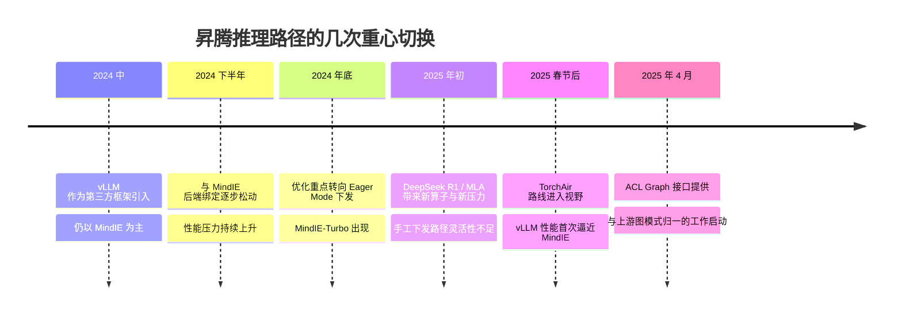

- [第一篇：有限视野下的初窥门径](/blog/graphs-in-vllm-ascend/)
- [第二篇：扩大视野，来聊聊编译](/blog/graphs-in-vllm-ascend-1/)
- [第三篇：理解全局后，再看设计方案](/blog/graphs-in-vllm-ascend-2/)
- [第四篇：进入深水区，回看那些“不得已”](/blog/graphs-in-vllm-ascend-3/)
- [第五篇：跃出水面，高维视角下的回顾](/blog/graphs-in-vllm-ascend-4/)

# 按“图”索骥：从 vLLM Ascend 的图模式聊开去
## 跃出水面，高维视角下的回顾

### 图模式之前是什么

如果熟悉 vLLM Ascend 的发展历史，可能会注意到：24 年中，vLLM 还只是作为第三方框架中的一员被引入昇腾生态（当时还有 TGI 等第三方框架，SGLang 尚未兴起），而真正被主推的，还是昇腾自研的推理框架 MindIE。

在一开始，vLLM 实际上对接的是 MindIE 的推理后端。也就是说，它的一切特性与能力，本质上都只能是 MindIE 的子集，vLLM 真正被用到的，其实只有最外层的 API 接口能力以及一部分调度能力。

这里稍微岔开一点，给大家补充一点背景。MindIE 中实际的推理流程，是手工维护在 `atb-models` 这个仓库里的，如果我没记错的话。大概是什么概念呢？就是任何模型，都需要有人用 C++ 去编写它对应的模型文件，相当于 vLLM 里的 `model_executor/models`。这样做的好处是，昇腾能对整个执行过程保持完全的控制，可以做一些特有的优化；坏处也很明显，那就是适配节奏非常慢。不同于 vLLM 里很多模型会由厂商主动适配，MindIE 每适配一个新模型，往往都要额外投入不少人力。

有了这个背景之后，我们也不难理解，随着模型结构迭代速度越来越快，手动组图的劣势逐渐盖过了其收益，也就明白为什么 vLLM Ascend 不再与 MindIE 后端绑定了。

而即使后面逐步解耦开来，一开始的 vLLM Ascend 也没有类似 CUDA Graph 的图模式。事实上，在 24 年底到 25 年春节前，也就是 DeepSeek R1 发布前，性能优化的重心仍然是尽量压低 Eager Mode 的下发开销。具体做法，是对一些特殊算子做定制处理，绕过以往繁琐的下发流程，直接调用底层接口。这个项目我们称为 `MindIE-Turbo`，这里就不展开了。

等到 R1 出来之后，MLA 结构又带来了不少新的算子接口，这时 MindIE-Turbo 的灵活性其实也开始不够用了。想想看，我们从 MindIE 的手工组图走到 MindIE-Turbo 的手工下发，抽象粒度确实更小，也确实更灵活，但依然难免捉襟见肘。面对新模型不断问世，适配速度并没有因此提高多少。

这时，TorchAir 进入了我们的视野。大家可能对 25 年发布 384 超节点还有一些印象，当时硅基流动率先公布了性能数据，而据我印象，这组数据用的就是 TorchAir 方案。TorchAir 这条路，其实和 PyTorch 1.x 的编译方案有些相似，只不过最终转换成的是昇腾这边 GE（Graph Engine）的 IR。不得不说，这个方案确实更通用地缓解了下发瓶颈，也第一次让 vLLM 在昇腾上的性能真正逼近了 MindIE。

但 TorchAir 的适配难度并没有这么简单，而且它和上游社区的方案之间仍然存在巨大差距，开源社区里的那些模型文件依然没法直接复用，所谓 0-Day 适配更是遥遥无期。

等到 25 年 4 月，ACL Graph 的接口终于提供出来，这时，与上游图模式归一的任务才算真正启动。算下来，距离我写这篇文章，也刚好过去了一年有余。

所以大家可以从整个发展历程中看出，在昇腾这边，性能在很长一段时间里始终都是第一位的诉求，过去很多事情都在为它让步。这让我想起当年 TensorFlow 和 PyTorch 的一些往事：在 TF 1.x 时代，模型必须先组好图，再由 `session` 去完整执行，这和 Torch 默认的 Eager 模式正好相反。前者在性能上通常会更占优一些，但 Torch 后来也提供了编译路径，所以两边的理论上限未必差得很远。

区别就在于默认的使用体验。

Eager 模式天生更利于学习和开发，所以它那一侧的生态也越长越繁荣。尽管 TF 在 2.x 时代也提供了类似的模式，但似乎终究还是晚了一些。此中有真意，能不能成为他山之石，就要看后来者是否愿意认真去鉴了。

### 透视问题本质：时与势

整篇文章写到这里，我们已经把昇腾上图模式的各个方面大致过了一遍：算子接口、编译后端、资源规格、行为差异，等等。那我们现在就有把握说，自己已经把这一块看得足够透了吗？

还是说，我们依然还在盲人摸象，陷在具体问题里，流于表面？为什么把一件事真正做好，会这么难？当然，严格来说，现在也还没有完全做好。

我们不妨像盘技术栈一样，从下到上盘一下问题：

1. **技术层**：
  - 底层硬件 / 编译器 / 算子能力本身还不够成熟；
  - 这一点我认为可以理解，芯片设计迭代速度确实受一些外界客观因素影响，18年19年就发布了 910 芯片，时隔近八年，才发布了新的 950 架构。硬件迭代速度远低于产业需求，而且是 ASIC，天生比 GPGPU 的通用性要弱。

2. **抽象层**：
  - 表面上看，是接口语义、框架抽象，与 CUDA / PyTorch / vLLM 的对齐程度不够；
  - 但问题又不只是“对不对齐”这么简单。更让人诟病的，其实是稳定性和统一性不足，本质上都在抬高开发者的迁移成本，消磨大家的热情和耐心。

3. **组织层**：
  - 有一句不算准确的话，叫“代码架构就是人事架构”。如果权责不清，那么各层软件栈的开发人员都会尝试越俎代庖，既导致烟囱式发展，也无法真正培养出全栈的通才；
  - 团队边界、评审机制，会直接投影到接口边界、默认行为和软件形态里。大家有时会想，制造业延续下来的管理制度与工作流程，是否仍然适用于这样一个日新月异的新兴产业？

4. **战略层**：
  - 兼容、差异化、性能、易用性，要同时都做到极致，客观上就是极难。就像是进入一个已经定义好规则的赛场，却又想再单独开出一条赛道。
  - 既要兼容既有生态，又要防止“卡脖子”，坚持自己的路线。NVIDIA 的先发优势可不是简单的“规格领先”，而是已经把工具链、生态、开发者心智和默认预期，一起做成了事实上的“标准”。

上面这些，更多还是内部各层级的问题。那么，这些问题背后是否还有一些共同的根因呢？

那我们再往上看，客观来讲，“时”并不尽在我。等到今天再来补生态，很多关键位置其实早已被人占住了，这也使得不少动作不得不发生变形：“交付型建设逻辑”和“生态型建设逻辑”长期并存，而且前者在很多阶段压过了后者。

- 交付型建设逻辑：
    - 先把客户问题解决；
    - 先兜底，保证生存；
    - 允许 workaround、特事特办、人力堆叠。

- 生态型建设逻辑：
    - 让更多人能在稳定规则下重复做成事；
    - 强调边界清晰、接口稳定、行为可预期；
    - 强调经验可以被外部复用，而不是只能靠内部专家传帮带。

这么一想，市场节奏和研发节奏错配，实在是一个再经典不过的问题。倒不如说，这两者如果真能长期配得严丝合缝，往往反而说明已经占据了某种近乎垄断的位置。但问题经典，不代表就有现成解法。事实上，我想不到有哪一家公司，能在自己的发展历程中始终完美权衡这两种节奏。

这里倒是可以借两个并不完全相同、但都属于追赶型生态的案例来对照着看。

先说 **OpenCL 和 CUDA**。OpenCL 在理念上几乎无可挑剔：开放、跨厂商、可移植，听上去像是更“正确”的方向。但CUDA 之所以后来越滚越大，不只是因为某个 API 更好，而是因为工具链、库生态、文档、框架支持、性能调优路径，被一起做成了一个稳定可依赖的整体。反过来看，OpenCL 的问题也不只是“性能差一点”，而是**你很难让开发者相信：未来是可预料的。** 兼容性如果只是写在规范里，而没有落成参考实现、默认行为和持续演进的边界资源，最后就很容易碎成一地补丁。

再说 **ROCm 和 CUDA**。这个例子更像我们今天面对的问题：不是从零做一套新东西，而是在进入一个已经被别人定义好规则的世界。表面上看，大家会说“那就把 capability 补齐就好了”，但真正做起来就会发现，追赶者要补的不只是这些，还包括那些已经被开发者习惯到看不见的体验层：版本矩阵、调试路径、默认性能、边角行为、文档质量、第三方项目的维护意愿。也就是说，**“能跑”不等于“低成本可持续使用”。** 这也解释了为什么有时候你会觉得某个平台明明已经投入了很多资源，却始终很难换来同等程度的开发者信任。

幸好，至少在国内这个阶段，大“势”所趋，大家对方向还算有一些共识。现在正是要借“势”来补“时”的时候了。首先必须承认，昇腾现在大力接轨开源生态，方向是对的，也算是在逐步回到正轨。再加上当前市场仍处于蓬勃发展阶段，昇腾的占有率也上来了，因此还保留着一定的容错空间，允许进行战线重整。但也正因为现在处于转型关键期，才更需要统一思想，不能再轻易滑回原先那套纯交付型逻辑。只有从源头上把方向扳正，才有可能抓住这个并不宽裕的窗口机会，把后面的路一步步走宽。

上面这些，还比较空。那如果再往下落一点，从“法”和“术”的角度看，我觉得至少有几件事是绕不过去的。

第一，**组织架构必须尽量降低问题闭环成本**。组织越庞大，沟通链路就越长，信息损耗也越大，问题自然越难快速闭环。往往客户的反馈，不能有效触达底层，于是都堆在适配层的代码中慢慢腐化。

第二，**堆叠人力，在某种程度上就是在透支未来**。早期靠专家兜底、靠专项支持、靠内部快速响应，这些都很正常，也难以避免；但副作用是，规避方案会越来越多，并逐渐沉淀成技术债务。有时候，适当以退为进、主动缩短战线，反而是更成熟的选择。

第三，**要敢于在顶层承认 trade-off**。兼容、差异化、性能、易用性，不可能永远同时做到极致。有些“家丑”不妨早点摊开讲清楚，先小人而后君子，先把边界说透，再谈后面的合作与期待。

当然，这些点讲到这里，仍然偏原则一些。再往下落到更具体的执行层面，还会有许多更琐碎、也更现实的问题需要处理，而那恰恰是生态建设最消耗人的地方。

这些思考，我能想到，其他人当然也能想到；而且昇腾也已经在尝试用一些措施去解决它们。只不过从目前看，这大概率仍会是一场持久战。

我写这篇文章，也不过是想尽量把一些本该被更多人了解的信息传递出来，让这些问题至少能被更完整地看见、被更认真地讨论。如果能帮到你，那我就很满足了。
