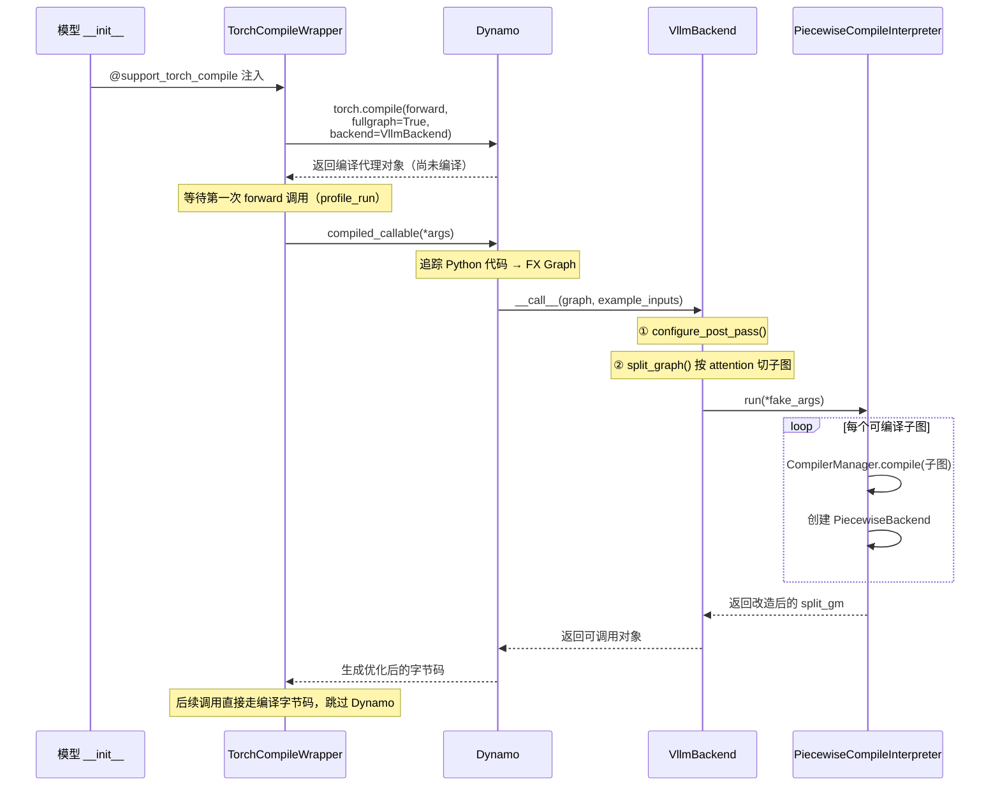
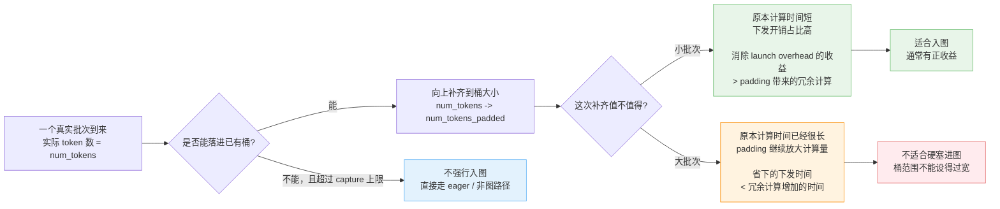

# [WIP] 按“图”索骥：从 vLLM 的图模式聊开去

## 有限视野下的初窥门径
之前我也写过类似的技术文档，每当写到“第一章节”，蹦进我脑中的往往就是一些“下定义”的话题，像什么“图是什么”，“图的意义”等等，如同掉进兔子洞一般，开始追逐这些“正确但作用有限”的答案。但这样只会让文章的范围无形中扩大，让大家在阅读时不知所措。

**所以我们先将问题限定到足够小：** 假设我们目前视野有限，使用的语言是 Python，框架是 PyTorch，只讨论 vLLM 中图模式的方案，并不关心 PyTorch 层以下的调用链路。而且我们已经有一个模糊的印象，**图模式能够通过“一次下发多个任务”减少 CPU 下发耗时，提升推理性能**。

换言之，我们**熟悉且仅熟悉**这一篇官方文档：[Accelerating PyTorch with CUDA Graphs](https://pytorch.org/blog/accelerating-pytorch-with-cuda-graphs/)。

**注意，如果咱们不看上边儿这篇官方文档，那么后续的内容可能会不好理解，且沟通起来容易出现背景和预期不统一的问题，这样本文的价值也就大打折扣了。**

在这个假设前提之下，我们便可以好好的来聊聊 vLLM 中为图模式做的工程化设计，以及 vLLM Ascend 中额外新增的一些修改。

### vLLM 图模式沿革

*等待编写。*

### 一切都为了“无感”
说完了 vLLM 中的设计，那说到 vLLM Ascend 里的工作：**如果做的够好，那么大家使用起来应该完全感受不到和 vLLM 中的差异。**

目前我们做的还是不错的，现在 vLLM Ascend 中使用图模式，已经非常接近上游 vLLM 的使用体验了，如果不追求极致优化，那么默认的配置就已经可以满足大多数需求。而关于一些很常见的问题，例如：
1. vLLM Ascend 怎么开启图模式？怎么验证图模式开启没有？
2. 图模式中的 `PIECEWISE` / `FULL` / ... 模式都是什么意思？怎么设置？
3. 不同的模型系列都支持 `PIECEWISE` / `FULL` 吗？怎么选择？
4. ...

这些使用层面的问题，可以说 95% 以上都可以在 vLLM 官方文档中可以找到对应的答案：[CUDA Graphs in vLLM](https://docs.vllm.ai/en/latest/design/cuda_graphs/)，vLLM Ascend 在这些问题中几乎是“隐形”的。

**如果你的问题可以在官方文档中得到解释，恭喜！下面的技术细节对于你来说可能无关紧要了。**

要是不乐意看英文文档，也可以试试直接向 DeepWiki 驱动的知识库进行提问，vLLM 和 vLLM Ascend 仓库均已支持该功能，分别在 [DeepWiki
vllm-project/vllm](https://deepwiki.com/vllm-project/vllm) 和 [DeepWiki vllm-ascend/vllm_ascend](https://deepwiki.com/vllm-project/vllm-ascend) 中进行提问即可。

### “那到底在忙些什么？”

> “啊既然使用起来都差不多，那这么些个图模式相关的开发工作和 PR 到底是在忙些什么？”

诶，正是因为水面下是脚蹼拼命划，水面上小鸭才叫“嘎嘎”。

**我们一大部分工作量，本质上都在解决同一个问题：当下层软件栈 / 硬件的行为与外部生态出现不一致时，如何通过工程手段，抹平这种差异。**

**差异？有什么差异？** 所以接下来我们就要先有个大概的范围认知，看看“底层硬件 / 技术栈 / 各种实现”到底还有哪些坑：

1. 算子接口的参数定义与校验规则：

    **这一项可以说是多个问题的终极根源**，以至于我必须把它放在第一个来说，我们以 PFA/IFA 算子（也即 `torch_npu.npu_fused_infer_attention_score` 接口，通常我们称其为 `FIA`）为例。

    - 要求来自 HOST / CPU 的输入参数：

        在 CUDA Graph 的设计下，我们习惯的操作模式是：

        1. **捕获（capture）阶段**：定义好计算图，Device 记住所有的 Kernel Launch 序列和参数指针。
        2. **重放（replay）阶段**：我们只需要修改 Device Tensor 中的数值（比如更新 `token_ids` 与 `positions`）。
        3. **核心前提**：Host 侧不做任何复杂的逻辑计算，Host 仅仅是负责“按下重放键”。
    
        但是不同于 vLLM 原生的 Attention 实现（所有的可变参数均以 Device Tensor 形式传入），vLLM-Ascend 中的 FIA 接口要求 `actual_seq_lengths` 与 `actual_seq_lengths_kv` 两个参数（分别来自 vLLM 中的 `query_start_loc` 与 `seq_lens`，也就是前面说的 Device Tensor）必须是 Host List。

        这会带来什么问题呢？

        **Host List 的存在，破坏了 CUDA Graph 的静态假设。**

        让我们思考一下，一张已经捕获好的 CUDA Graph / ACL Graph，是不是理论上只会在 `graph.replay()` 时获取一次信息？而且这些信息都来自于提前设置好的 Device Memory 地址。所以在重放时，对于图内的算子来说它们没有办法获取到最新的 `actual_seq_lengths` 与 `actual_seq_lengths_kv` 信息。**那么我们最后模型输出出来的结果自然就会是重复的文本，因为图中只有捕获时的“过时信息”。**

    - 参数之间的校验：

        对于 FIA 来说，当其输入张量的排布为 `[T, N, D]`（参考[参数说明](https://www.hiascend.com/document/detail/zh/Pytorch/730/apiref/torchnpuCustomsapi/docs/context/torch_npu-npu_fused_infer_attention_score.md#参数说明)）存在以下约束（参考[约束说明](https://www.hiascend.com/document/detail/zh/Pytorch/730/apiref/torchnpuCustomsapi/docs/context/torch_npu-npu_fused_infer_attention_score.md#约束说明)）：

        > `actual_seq_lengths` 和 `actual_seq_lengths_kv` 必须传入，且以该入参元素数量作为Batch值（注意入参元素数量要小于等于4096）。该入参中每个元素的值表示当前Batch与之前所有Batch的Sequence Length和，因此后一个元素的值必须大于等于前一个元素的值；

        或许文档有一些抽象，我们来看一个算子报错会明显一些：

        ```
        E89999[PID: 5220] 2026-01-29-12:52:08.136.001 (E89999):  When layout is TND, queryT(8) must be equal to the last element of actualSequenceLengthQ(5)[FUNC:CheckFAISeqlenDataInTND][FILE:fused_infer_attention_score_tiling.cpp][LINE:904]
        ```

        这下好理解了，也就是说存在类似这样一个校验（如果有感兴趣的话可以直接看[源代码](https://gitcode.com/cann/ops-transformer/blob/master/attention/fused_infer_attention_score/op_host/fused_infer_attention_score_tiling.cpp)，发挥开源社区的优势！）：

        ```python
        assert actualSequenceLengthQ[-1] == queryT.shape[0]
        ```

        尽管初看起来，这个校验可以说正常，无害，且合理，**但实际上在图模式中，它造成了很多次严重的问题**：原因就在于**这样的校验在 vLLM 的 Attention 算子中是没有的**，在图内流转的张量，第 0 维形状全是被填充到 `cudagraph_capture_sizes` 中的固定数值。那有人就要说，“啊，接口有差异这不很正常吗？不然你做框架适配是在做什么东西？”，当然没问题，稍后我们会来复盘为什么这样一个校验可能多次造成困扰，有哪些历史遗留问题，以及我们能从中吸取什么经验教训。

2. 捕获占用的资源与流规格的设计

    与 CUDA Graph 可以捕获任意数量的图不同，**ACL Graph 每捕获一张图都会占用一个流（Stream）资源**。然而，受限于驱动层限制，硬件可用的流资源总量有限，910 系列为 2048 条，310 及 710 系列据说为 1024 条，未经实测。需要注意的是，这几千条流是由整个软件栈共享的，不仅是上层的推理框架 vLLM，底层的 PyTorch 和 CANN 组件也都在“瓜分”这些有限的资源。

    看到这里大家可能会觉得，“哦好像还好啊？听起来两千个也挺多，难不成我们会需要捕获几千个图吗？”，诶，**还真是！** 不过我们先在这里卖个关子，至于为什么在推理场景中会触及到这个规格上限，我们先在此埋个伏笔。直接铺开讲可能会略显琐碎，等后文介绍完基础概念后，我们再回过头来深入拆解这个问题，便于理解，事半功倍！

3. 编译后端的支持完善程度

    写到这里的时候我突然想起来，咱们漏了一个关键背景： `torch.compile` 以及它在 vLLM 图模式中的定位，这一点确实是疏忽。这两者的联系并非那么紧密，完全可以各自单独使用的，所以之前我没有找到好的话头来提起。**别着急，我们马上在下一章就会讲到编译。**

    当前在昇腾硬件上，对于 `triton` 这样的编译后端（在编译链路中扮演多重角色，此处我们仅讨论其作为 Inductor 后端的功能）支持还并不完善。**vLLM Ascend 在很长一段时间是没有后端可用的（严格来说有 `npu_backend`，不过那是 TorchAir，暂不讨论）**，在这种情况下，我们想要对 `torch.compile` 出来的 FX 图进行高效的自动化转换与优化是有些困难的（并非不能做，现在已经实现了），这导致特性开发者被迫在模型定义脚本中硬编码性能优化逻辑。这种做法的弊端显而易见：每个模型都需要进行“霰弹式修改”，优化经验难以复用和迁移。
    
    此外，手动优化的另一大难题是**控制流**。记得我们之前说的吗？图模式不喜欢 `if-else` 这种动态的行为。如果拥有完善的 Inductor 后端，我们可以在 compile 阶段通过算子下发或图改写来拦截并处理控制流问题，同时针对不同的 Shape 生成对应的 FX 图，从而平衡通用性与执行效率。

写到这里我长舒一口气，终于在尽可能不扯远的情况下，写完了这一部分，尝试解答了“vLLM Ascend 中的额外设计来源”这个问题：**所有的“特殊设计”，最终都可以溯源到以上这几种差异，也就是：**
1. 算子接口以及内部校验带来的问题；
2. 硬件规格与 ACL Graph 本身设计与 Nvidia 生态的不同；
3. 软件栈依赖的缺失或者成熟度不够。

回头一看，为了解答这个问题，我们可能没头没脑地又引入了更多更深的概念，思之不免令人发笑，希望不要阻止大家继续往下看才好。

### 在官方文档上再进一步
在继续深入那些令人生畏的具体代码之前，我们还可以先确认下哪些东西是**不需要**我们操心的。

如果我们已经看过了之前提到的官方文档（[CUDA Graphs in vLLM](https://docs.vllm.ai/en/latest/design/cuda_graphs/)），那我们应该对其中的几个基础组件已经有了认知，我们来简单回顾一下：

官方文档中详细解释了 `CUDAGraphWrapper` / `CudagraphDispatcher` / `CUDAGraphMode` / `BatchDescriptor` 四个组件的设计，并且提供了下图来可视化调用流程：


**好消息是：在 vLLM-Ascend 中，这套流程的“骨架”被完整保留了下来。**

是这套抽象层足够稳健，所以我们才能直接复用吗？不，回想一下我们在上一节怎么说的？

> 所有的“特殊设计”，最终都可以溯源到以上差异

**啊哈！原来是因为这四个组件基本上都是 Python 原生的代码语法，甚至 PyTorch 的含量都不高，所以我们才能直接复用！**

唯一值得提一下的区别，是 `NPUModelRunner` 中对于 `CudagraphDispatcher` 的使用方法，稍微和 `GPUModelRunner` 中有一些不同：针对 `num_tokens` 的填充逻辑（这个填充逻辑会在后面详细展开，先不在这里岔开话题）有不同。

> **关于 V2 Model Runner：** 在本文撰写时，vLLM 的 V2 Model Runner 已经开始落地，但官方设计文档尚不完备，接口也可能随时调整。这里简单提几个结论供大家留意：
> 
> 1. V2 为主模型的 **FULL** 图模式引入了显式的管理，`ModelCudaGraphManager`，将 capture / dispatch / replay 收口到一处管理；
> 2. **PIECEWISE** 则没有被推倒重来，仍沿用 wrapper + forward\_context + batch descriptor 这套机制；
> 3. 此外，target model 和 EAGLE draft model 在 V2 中也各自有了清晰的 graph owner（`EagleCudaGraphManager`）。
>
> 如果你已经在跟进 V2 的代码，留意这些变化即可，如果还没有，先按本文介绍的 V1 体系理解，不影响全局认知。

## 除了“捕获/重放”，还有编译

这一章我们来聊聊**编译**，在开始之前，强烈建议大家先浏览以下两篇文档，不需要逐字精读，但至少翻一遍有个印象，**如果后面有些地方看着迷糊，也可以回头来翻一翻**：

- [torch.compile](https://docs.pytorch.org/docs/stable/user_guide/torch_compiler/torch.compiler.html)：PyTorch 官方对 `torch.compile` 三层架构的介绍
- [torch.compile integration](https://docs.vllm.ai/en/latest/design/torch_compile/)：vLLM 官方的 `torch.compile` 集成设计文档

基础的概念我们不会在这篇文章中深究，那样事情就会变得无聊冗长了，而且实属重复造轮子。

### 都叫"图"，到底有什么不同？

有个问题我一直想找机会说清楚：`torch.compile` 和 CUDA Graph 都跟"图"沾边，但它们**完全不是一回事**。很多人来问问题的时候，问题里问的是“ACL Graph 如何如何”，但实际上问题属于编译的范畴（比如启动时出现 Dynamo 的报错），这一点大家一定要搞清楚。

**`torch.compile` 是编译期的优化。** 它做的事情是：把你写的 Python 代码追踪（trace）成一张计算图（FX Graph），然后在这张图上做各种变换——算子融合、内存优化、甚至直接生成硬件原生的 kernel 代码（比如 GPU 上的 Triton kernel）。你可以理解为它把 Python 写的模型翻译成更高效的执行形式。

**CUDA Graph 是运行期的优化。** 它做的事情是：在第一次运行时，把 GPU 上所有的 kernel 启动序列"捕获"下来，之后每次推理直接"回放"这段录像，省掉了 CPU 侧反复下发 kernel 的开销。它不关心你的代码写得好不好、有没有优化过，它只管“一次性下发”。

因为它们解决的是不同层面的问题，所以两者可以结合起来使用：`torch.compile` 让你的计算本身跑得更快（更少的 kernel、更少的中间张量，不同资源利用效率更高），CUDA Graph 让计算的**启动开销**趋近于零。打个比方：`torch.compile` 是把统筹规划，把原先的十道菜，合成五道菜，营养不变，CUDA Graph 则是把炒菜的动作从"备菜 - 做菜"变成"流水线自动做菜"。两者叠加，才有了我们现在看到的图模式性能。

**编译的核心收益，是 fusion pass——算子融合。**

什么意思呢？假设模型中有一段逻辑是 `RMSNorm → Quantize → ...`，在 eager 模式下，每个操作都是一个独立的 kernel launch：先启动 RMSNorm 的 kernel，等它算完，把结果写回显存，再启动 Quantize 的 kernel，再从显存读取。看，多么麻烦！

而 fusion pass 做的事情，就是**在 FX 图上做模式匹配**：发现“诶，这两个操作可以合并成一个”，然后直接替换成一个融合后的算子。一次 launch，一次读写，干完两件事。**当然前提是你得有这么些个对应的融合算子。**

在 GPU 上，vLLM 的 `PostGradPassManager` 注册了 8 个以上的 fusion pass，覆盖了 AllReduce + RMSNorm 融合、RMSNorm + Quantize 融合、RoPE + KV Cache 融合等常见模式。这些 pass 是在 Inductor 内部通过 `post_grad_custom_post_pass` 钩子执行的——也就是说，Inductor 在把 FX 图转成 Triton kernel（lowering）之前，会先跑一遍这些 vLLM 自定义的融合规则。除此之外，Inductor 自身还有 codegen 层面的优化：它会自动生成针对具体 shape 的 Triton kernel，支持 auto-tuning 来选择最优的 kernel 参数等等。这些都是 eager 模式下享受不到的。

### 除此之外，`torch.compile` 还带来了什么

那 `torch.compile` 在 vLLM 中除了编译优化，还做了什么？诶，很多人可能知道 `PIECEWISE` 这种图模式，具体这模式是啥我们后面再讲。顾名思义，`PIECEWISE` 它得把图处理成一个个“PIECE”啊，那“切图”这部分工作就是在编译这阶段完成的——将 attention 部分的代码，统一注册成一个自定义算子，把模型按这些自定义算子切成若干子图，好让 CUDA Graph 分段捕获。如果没有编译，将各种模型结构处理成统一的中间表示，那么这个切分逻辑的维护成本，可能就会相当之高了。

**当我们说"编译"的时候，切图只是其中一个环节，fusion pass 加上 Inductor 优化才是性能收益的大头。** 理解了这一点，也就不难理解为什么后面我们要花笔墨讲 Ascend 在没有 Inductor 的情况下是怎么做的了。

### 简单看下 vLLM 的编译链路

有了以上的认知，我们来快速过一遍 vLLM 中 `torch.compile` 的工作流程。



一切从 `@support_torch_compile` 装饰器开始。这个装饰器并不会直接编译任何东西：在模型的 `__init__` 阶段调用 `torch.compile(self.forward, fullgraph=True, backend=VllmBackend)`，拿到一个编译代理对象。但真正的编译要等到模型第一次 `forward` 调用时才会触发，这就是惰性编译（Lazy Compilation）。

当第一次 `forward` 被调用，也就是 `profile_run` 的时候，Dynamo 开始追踪 Python 代码，生成一张完整的 FX Graph，然后把它交给 `VllmBackend`。`VllmBackend` 拿到图之后做了三件关键的事：

1. **`configure_post_pass()`**：把前面说的那些 fusion pass 注册到 Inductor 的配置里，等后续编译子图时让 Inductor 去调用。
2. **`split_graph()`**：按 attention 算子把整张大图切成若干子图。为什么要在 attention 处切？因为 attention 的逻辑比较复杂且多变（不同的 backend、不同的 shape 策略），有时候不兼容 CUDA Graph，所以 vLLM 选择让 attention 跑 eager，其余部分才走图模式。
3. **`PiecewiseCompileInterpreter`**：遍历切好的子图，为每个子图创建一个 `PiecewiseBackend` 实例。这个实例负责在运行时根据实际的 token 数量（runtime shape），分发到对应的编译版本去执行。

至此，编译阶段完成。后续的每一次 `forward` 调用，都会跳过 Dynamo 的 guard 检查，直接走已编译好的路径。

### vLLM Ascend：没有 Inductor 怎么办

到这里，大家可能已经发现了一个问题：上面整条链路里，Inductor 扮演着核心角色——fusion pass 要靠它的钩子来跑，codegen 要靠它来做，auto-tuning 也是它的活儿。**那如果没有 Inductor 呢？**

这正是 vLLM Ascend 面对的现实。昇腾硬件上没有成熟的 Triton 作为 Inductor 后端（这一点我们在第一章的"编译后端的支持完善程度"中提过），这意味着 Inductor 的整条路走不通。但 fusion pass 带来的性能收益我们又不想放弃——那怎么办？

答案是：**绕过 Inductor，但保留 fusion pass 的能力。**

当 `PiecewiseCompileInterpreter` 遍历到某个子图需要编译时，调用链走到的不再是 Inductor，而是 `AscendCompiler.compile()`。这个方法内部调用了 `fusion_pass_compile()`，其中的核心是一个叫 `compile_inner` 的闭包：

```python
def compile_inner(graph, example_inputs):
    current_pass_manager = compiler_config[COMPILATION_PASS_KEY]
    graph = current_pass_manager(graph)  # 跑 Ascend 的 fusion pass
    return graph  # 直接返回修改后的 GraphModule
```

这个 `compile_inner` 被当作 `fw_compiler`（前向编译器）传给了 `aot_autograd`。AOT Autograd 完成 functionalization 之后，回调 `compile_inner`，在这里面跑 `GraphFusionPassManager` 的所有 pass，然后直接把修改后的 FX GraphModule 返回。

**没有 Triton codegen，没有 `.so` 生成，没有 auto-tuning**——取而代之的是：fusion pass 把多个小算子替换成 Ascend 的融合自定义算子（通过 `torch_npu` dispatch 到 CANN 的优化 kernel），然后以 eager 模式执行这张优化过的图。

`GraphFusionPassManager` 当前注册了一些 Ascend 专属的 fusion pass，每个 pass 都使用 PyTorch 的 `PatternMatcherPass` 在 FX 图上做子图模式匹配和替换——这与 GPU 侧的 fusion pass 在技术手段上是完全一致的，区别只在于匹配的模式和替换的目标算子不同。

### 第三条路：npugraph_ex

上面说的 `fusion_pass_compile` 是之前的“权宜之计”。现在我们有了 `npugraph_ex`，这是基于 torchair（昇腾的 PyTorch 图编译器）的第三条编译路径。从 v0.15.0rc1（2026-02-12）起默认开启，但仅在 `FULL_DECODE_ONLY / FULL` 模式下生效，而在 `PIECEWISE` 模式下 platform.py 会强制关闭它，回退到 `fusion_pass_compile`。

npugraph_ex 基于昇腾的 [torchair](https://gitcode.com/Ascend/torchair) 图编译器。虽然同样经过 AOT Autograd 的 functionalization，但之后由 torchair 接管 FX 图的优化和编译：

那 fusion pass 怎么办？难道要维护两套吗？这里有一个巧妙的设计：vLLM Ascend 的每个 fusion pass 在注册时，**同时注册到两个引擎：** 既注册到 inductor 的 `PatternMatcherPass`（给 `fusion_pass_compile` 用），也通过 `torchair.register_replacement` 注册到 torchair（给 npugraph_ex 用）。同一套 pass 定义，两条执行通道，走哪条路都能生效。

此外，torchair 自身还额外带来了一些 `fusion_pass_compile` 没有的优化：逆转 AOT 的 functionalization（恢复 in-place 操作以减少内存搬移），以及[几个内置的算子融合规则](https://www.hiascend.com/document/detail/zh/Pytorch/730/modthirdparty/torchairuseguide/torchair_00017.html)。

下面这张图展示了完整的三条编译链路。共用部分从 Dynamo 一直延伸到 `CompilerManager.compile()`，在此之后 GPU 和 Ascend 分道扬镳；而 Ascend 内部又根据图模式进一步分岔：

```mermaid
flowchart LR
    A["<b>Dynamo</b><br/>追踪 forward<br/>→ FX Graph"] --> B["<b>VllmBackend</b><br/>configure_post_pass()"] --> C["<b>split_graph</b><br/>按 attention 切子图"] --> D["<b>PiecewiseCompile<br/>Interpreter</b><br/>遍历子图"] --> F{{"<b>CompilerManager<br/>.compile()</b><br/>分岔点 ①"}}

    F -->|"GPU · InductorAdaptor"| H1["<b>AOT Autograd</b><br/>functionalization"]
    F -->|"Ascend · AscendCompiler"| G{{"<b>enable_npugraph_ex?</b><br/>分岔点 ②"}}

    G -->|"False（PIECEWISE）"| H2["<b>AOT Autograd</b><br/>functionalization"]
    G -->|"True（FULL）"| H3["<b>AOT Autograd</b><br/>functionalization"]

    H1 --> I1["Inductor 调钩子<br/><b>PostGradPassManager</b><br/>8+ fusion pass"]
    H2 --> I2["compile_inner 回调<br/><b>GraphFusionPassManager</b><br/>Ascend fusion pass"]
    H3 --> I3["torchair 内部<br/><b>FX 优化 + fusion pass</b><br/>+ in-place 恢复"]

    I1 --> J1["Inductor <b>lowering</b><br/>→ Triton codegen"]
    I2 --> J2["<b>直接返回</b><br/>eager GraphModule"]
    I3 --> J3["编译为<br/><b>ACL Graph</b> 可执行形式"]

    J1 --> L["<b>CUDAGraph / ACLGraph</b><br/>Wrapper 包裹"]
    J2 --> L
    J3 --> L

    style F fill:#fff9c4,stroke:#f57f17,stroke-width:2px,color:#000
    style G fill:#fff9c4,stroke:#f57f17,stroke-width:2px,color:#000
    style I1 fill:#fff3e0,stroke:#e65100,color:#000
    style J1 fill:#fff3e0,stroke:#e65100,color:#000
    style I2 fill:#e3f2fd,stroke:#1565c0,color:#000
    style J2 fill:#e3f2fd,stroke:#1565c0,color:#000
    style I3 fill:#e8f5e9,stroke:#2e7d32,color:#000
    style J3 fill:#e8f5e9,stroke:#2e7d32,color:#000
```



### 方案路线沿革

说到这里容我忆苦思甜一下，上面这张三条路并行的图看着挺整齐，但 Ascend 的编译方案并非一步到位，而是经历了四代演进：

1. **手动改写模型脚本**：最早期的做法。每个模型里该融合的算子，都要手动改写并覆盖 vLLM 的模型定义。每出一个新模型就要改一次，没改过的模型享受不到任何优化，适配成本极高。
2. **`GraphRewriter` 方案**：引入了 PyTorch 的 `GraphRewriter` 组件，算是有了统一的改图接口，但仍然不够灵活。
3. **`AscendCompiler` + `fusion_pass_compile`**：也就是上文介绍的蓝色路径。通过平台钩子接入 vLLM 的编译框架，用 `PatternMatcherPass` 做自动化的子图匹配和替换，终于摆脱了逐模型手改的困境。
4. **npugraph_ex**：也就是绿色路径。由 torchair 接管编译，自带额外优化，目前是 FULL 模式下的默认方案。

从"每个模型手动改"到"框架自动做"，这条路走了不短的时间。而这个演进方向也很明确：**把优化逻辑从模型代码中彻底剥离，下沉到编译层去自动完成。** 不过注意，现在依然是没有 codegen 能力的。

但是下一步呢？我们什么时候能用上和 CUDA 一样原生的 Inductor 能力呢？还是说会有其他的路线？这些问题暂时还不明朗。


## 分桶与填充与动态性

编译的话题告一段落了，那图模式的两大板块儿我们就算是都讲过一点儿了。那这一章我们重新回到 ACL Graph 静态图这边，来讲讲填充与分桶。为什么？还记得我们之前说 FIA 的校验反复造成困扰吗？它的 Host 参数又是怎么在图模式里刷新的？这一章。但在那之前，先聊一个看似简单、却牵扯出连锁反应的基础问题：**图模式为什么需要固定 Shape？**

### 图模式的约束

PyTorch 官方文档中有一段非常精炼的 [Constraints](https://docs.pytorch.org/docs/main/notes/cuda.html#constraints) 说明，**强烈建议快速过一遍**。其中最基本的：

- **Dynamic shapes are prohibited.** 图假设捕获序列中的每个张量，在每次重放时具有相同的大小和布局。
- **Every replay reads from and writes to the same (virtual) memory addresses.** 重放时不会重新分配内存，直接使用捕获时的地址。
- **Ops that synchronize the CPU with the GPU are prohibited.** 比如 `.item()` 这类操作，在图内是不允许的。

也就是说 **图内的一切都是"定死"的——形状、地址、执行路径。**

那问题来了：推理服务中每个批次的请求数量是变化的，`num_tokens` 不可能每次都一样。怎么办？

### 分桶

答案是**分桶（Bucketing）**：提前选好一组固定的桶大小，针对每个桶大小各捕获一张图。然后运行时把实际的 `num_tokens` 向上取整到最近的桶大小，多出来的部分用 padding 填充。

vLLM 中默认的桶列表长这样：

```
[1, 2, 4, 8, 16, 24, ..., 248, 256, 272, 288, ..., max]
```

小批次间隔密（步长 8），大批次间隔稀（步长 16），`max` 默认是 `min(max_num_seqs * decode_query_len * 2, 512)`。`CudagraphDispatcher` 在初始化时会用这组数字构建一张 O(1) 的查找表——给定任意 `num_tokens`，直接查表就能得到它该用哪个桶，一次数组访问搞定，不需要二分查找。

> NPU 上有一些细微差异：默认的 `max` 更保守（去掉 `*2`，这个是受 MC2 通信算子的影响，哎，又是一个特殊问题），SP 模式下还会过滤掉不能被 `tp_size` 整除的桶。但整体策略完全一致。

那大家就问了，多了填充，不就存在冗余计算吗？的确，这就是一个权衡，所以不能把桶的范围设置过宽，什么批次大小来了都捕获一遍。**假如批次较大，原本计算耗时就已经长于下发耗时，那么此时仍然去做填充让其入图，反而会降低性能。**



诶，这时候大家又说了，填充会降低性能，那我步长为一来捕获，不触发填充，不就没问题了吗？真聪明，但是一是没必要，计算瓶颈了咱就老老实实走即时下发模式就行了；**二是桶也不是越多越好，** 每多一个桶，就意味着多捕获一批图，而在 ACL Graph 上捕获图的资源代价可比 CUDA 大得多，我们在下一节讲模式的时候就知道了。

### 当填充遇上 FIA

好，终于到了复盘环节，先回忆一下校验：

> `actualSequenceLengthQ[-1] == queryT.shape[0]`

**问题的本质**：图模式将 `hidden_states` 的第 0 维填充到了桶大小（一个固定值），但 FIA 要求 `actual_seq_lengths_q` 的最后一个元素也等于这个固定值。而 `actual_seq_lengths_q` 是根据实际请求数量构建的，**两者天然对不上。**

在上游 vLLM 中，GPU 的 Attention 算子没有这个校验，所以填充就是填充，不需要额外操心。但在 vLLM Ascend 中，**每一个涉及"改变 token 数量"的特性，都会独立地触发这个问题，叠加起来，更是恐怖：**

1. **基础图模式**：桶填充导致 `shape[0]` 膨胀 → 引入了修复方法，在 `query_start_loc` 末尾插入虚假请求，让最后一个元素等于填充后的 `num_tokens`。这个函数目前在 v1、v2、310P 三套 Model Runner 中各有一份独立拷贝。

2. **SP（序列并行）**：SP 也会把 `num_tokens` 向上对齐到 `tp_size` 的倍数。所以即时不开启图模式，也需要为这个校验而修复。

3. **DP（数据并行）**：`dp_size > 1` 时，所有 rank 的 `num_tokens` 会通过 all-reduce 统一到最大值。本 rank 可能只有 5 个 token，但全组最大是 8，那你的 `num_tokens_padded` 就变成了 8，又多了一层填充需要善后。

4. **MTP / Eagle**：首先，推测解码的首轮和后续轮次，批次大小是不一样的，这就已经有问题了，更添乱的是，vLLM V1 中的推测解码，被设计为不支持 `FULL` 模式，所以会对相关属性做“去填充”的操作。所以这一部分的代码目前看来是到处漏风，只能祈祷原生支持 `FULL` 模式的 V2 能够拯救未来的代码仓了。

6. **CP（上下文并行）**：每个 rank 分到的 token 数与填充后总量不一致，需要额外补零；MLA+CP 甚至直接用一个 `arange` 替换掉了原始的 `actual_seq_lengths_q`。

**多个场景，同一个坑。** 这就是"组合爆炸"，也就是之前说的“造成了很多次严重的问题”：每个独立的特性都会改变 token 的数量或分布，而 FIA 的这个校验在上游 vLLM 中不存在，不会有上游开发者帮你预想到这个约束。每次引入新的并行策略或投机解码方案，都要有人 **"重新发现"** 这个问题，然后在各自的代码路径中修一个 patch。

### Host List 与 graph_task_update

另一个伏笔：**FIA 要求 `actual_seq_lengths` 以 Python list 形式传入**，而图重放时只会重复捕获时冻结的旧值。

还记得我们在第一章怎么说的吗？

> 对于图内的算子来说，它们没有办法获取到最新的 `actual_seq_lengths` 信息。那么最后模型输出出来的结果自然就会是重复的文本，因为图中只有捕获时的"过时信息"。

解法分两步：

**捕获时"预埋"**：图捕获阶段，每层 Attention 中的 FIA 调用被包裹在 `graph_task_group_begin/end` 之间。这对 API 会告诉 CANN："这段算子的 Host 参数后续可以修改"，并返回一个 handle。同时，在 FIA 前面还会植入一个 `ExternalEvent.wait` 来等待更新操作执行完毕，图重放到这里会暂停，等信号才继续。

**重放时"更新"**：每次 replay 之后，在一条专用的 `update_stream` 上，通过 `graph_task_update_begin/end` 打开保存的 handle，传入当前批次真实值，重新下发并做 tiling，然后 `event.record` 发出信号。主流上的 FIA 收到信号，带着新参数继续执行。

**`ExternalEvent` 是整套机制的时序保证**：不管两条流的执行速度差多少，FIA 一定是拿到了当前批次的参数之后才会执行。这个设计在主流 CUDA Graph 生态中找不到对应物，它完全是为了适配 FIA 的 Host 参数特性而生的。

## FULL / PIECEWISE / FULL_DECODE_ONLY

*等待编写。*

- 三种模式各自做什么（原理简述）
  - PIECEWISE：按 attention 切子图，attention 跑 eager，其余走图
  - FULL：整个 forward 一张图，包括 attention
  - FULL_DECODE_ONLY：仅 decode 阶段走 FULL，prefill 走 eager
- FULL_AND_PIECEWISE 模式（vLLM v1 默认）：
  - decode 走 FULL，prefill 走 PIECEWISE
  - 在此处带出 prefill vs decode 的图模式差异
- 使用层面的限制与选择：哪些模型/场景能用哪种，不能用时的原因
- 流资源耗尽问题（兑现第一章伏笔）：
  - ACL Graph 的核心差异：每张被捕获的图都需要占用计算流和通信流，GPU 上的 CUDA Graph 不需要
  - PIECEWISE 的组合爆炸：每个桶 × (num_hidden_layers + 1) 个子图 × 通信域数 = 流消耗，2048 上限很快打满
  - FULL 下为什么没事：整个 forward 只有一张图/桶，流消耗低几个数量级
  - `update_aclgraph_sizes` 的应对策略：计算硬件上限后自动裁剪桶数量

## 性能

*等待编写。*

- 图模式的性能收益来源：launch overhead 消除 + fusion + 编译优化
- 不是万能药：warmup / 编译开销、额外内存占用、对动态 shape 不友好
- GPU 推荐 PIECEWISE / NPU 推荐 FULL 的核心原因：
  - GPU：x86 CPU 下发性能好，attention 跑 eager 的开销可接受，PIECEWISE 够用
  - NPU：CPU 下发性能弱，必须把 attention 的下发开销也消除，所以需要 FULL
  - 结合上一章的流资源约束，解释为什么这不仅是"推荐"而是几乎"必须"
- 实际性能数据或对比案例（如果有的话）

## 适配指南（大纲，暂不填充）

- torch.compile 兼容：如何避免 graph break，`torch.compiler.is_compiling()` 守卫
- ACL Graph 兼容：哪些操作导致捕获失败（动态 shape、Host Tensor、控制流）
- 典型适配流程 / Checklist
